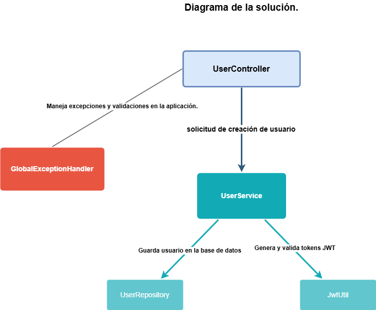

# API RESTful para la creación de Usuarios 

Esta es una API RESTful para la creacion de usuarios. La aplicación se desarrolló utilizando Java 8+, Spring Boot y H2 Database.

## **Requisitos**
-**Java 8+** instalado en el sistema.
-**Maven** para compilar y ejecutar el proyecto.
-Cliente para probar APIs REST:
	-Ejemplo: Postman o cURL

## Cómo ejecutar el proyecto
1. Clonar el repositorio:
	```bash
   git clone https://github.com/AztyLovelace/api-user-creation.git
2. Dirigirse al directorio del proyecto
	-cd <DIRECTORIO/api-user-creation>
3. Compilar y ejecutar la aplicación.
 	-mvn spring-boot:run
4. La aplicacion estará disponible en: http://localhost:8083

## Cómo probar el endpoint
	-**URL:** `http://localhost:8083/user/creation`
	-**Método:** `POST`
	-**Header:**
		-`Content-Type: application/json`
	## Ejemplo request body:
	```json
	{
	    "name": "Cynthia",
	    "email": "prueba.email@gmail.com",
	    "password": "goodtest",
	    "phones": [
	        {
	        "number": "12345678",
	        "citycode": "1",
	        "contrycode": "57"
	        }
	    ]
	}
	
## Respuestas Posibles

### 1. Registro exitoso (201 Created):
	```json
	{
	    "id": "8d2c2394-038b-4fbf-a19d-7425a17517f6",
	    "created": "2024-12-19T12:00:00",
	    "modified": "2024-12-19T12:00:00",
	    "last_login": "2024-12-19T12:00:00",
	    "token": "eyJhbGciOiJIUzI1NiIsInR5cCI6IkpXVCJ9...",
	    "isactive": true
	}
### 2. Errores de validacion
	```json
	-(400 Bad Request):
		{
		    "email": "The email is not in a valid format"
		}
	-(409 Conflict):
		{
		    "message": "This email has already been registered"
		}
		
## Diagrama de la solución
