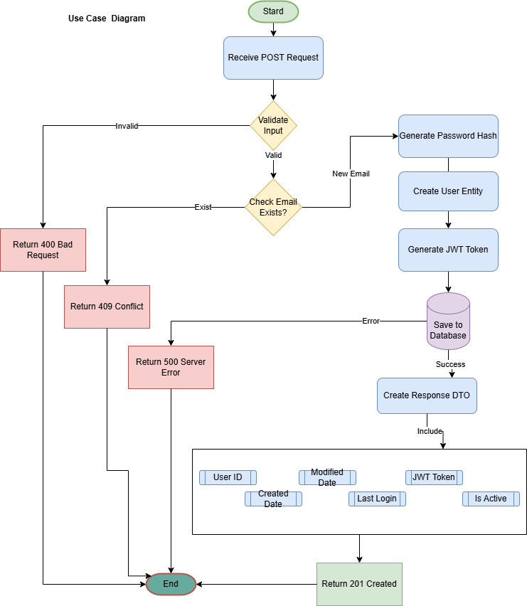

# API RESTful para la creación de Usuarios 

Esta es una API RESTful para la creación de usuarios. La aplicación se desarrolló utilizando Java 17, Spring Boot y H2 Database.

## Requisitos
- **Java 17** instalado en el sistema
- **Maven** para compilar y ejecutar el proyecto
- Cliente para probar APIs REST (Postman, Swagger UI o cURL)

## Cómo ejecutar el proyecto
1. Clonar el repositorio:
```bash
git clone https://github.com/AztyLovelace/api-user-creation.git
```

2. Dirigirse al directorio del proyecto:
```bash
cd api-user-creation
```

3. Compilar y ejecutar la aplicación:
```bash
mvn spring-boot:run
```

4. La aplicación estará disponible en: http://localhost:8083

## Cómo probar el endpoint

### Usando Swagger UI
1. Acceder a Swagger UI: http://localhost:8083/swagger-ui/index.html
2. Navegar al endpoint POST /user/creation
3. Hacer clic en "Try it out"
4. Usar el siguiente ejemplo de payload:

```json
{
    "name": "Cynthia Abarca A",
    "email": "cynthia.test@gmail.com",
    "password": "Password123",
    "phones": [
        {
            "number": "1234567",
            "cityCode": "1",
            "countryCode": "57"
        }
    ]
}
```

### Usando Postman
- **URL:** `http://localhost:8083/user/creation`
- **Método:** `POST`
- **Headers:**
  - `Content-Type: application/json`

## Respuestas Posibles

### 1. Registro exitoso (201 Created)
```json
{
    "id": "8d2c2394-038b-4fbf-a19d-7425a17517f6",
    "created": "2024-12-19T12:00:00",
    "modified": "2024-12-19T12:00:00",
    "lastLogin": "2024-12-19T12:00:00",
    "token": "eyJhbGciOiJIUzI1NiIsInR5cCI6IkpXVCJ9...",
    "isActive": true
}
```

### 2. Email ya registrado (409 Conflict)
```json
{
    "message": "Email already registered: john.doe@example.com",
    "timestamp": "2024-12-26T17:12:11.201Z"
}
```

### 3. Datos inválidos (400 Bad Request)
```json
{
    "timestamp": "2024-12-26T17:12:11.201Z",
    "errors": [
        {
            "field": "email",
            "message": "Invalid email format"
        },
        {
            "field": "password",
            "message": "Password must be at least 8 characters long and include uppercase, lowercase, and numbers"
        }
    ]
}
```

## Reglas de Validación
- **Nombre**: Obligatorio, 3-50 caracteres
- **Email**: Formato de email válido
- **Contraseña**: Mínimo 8 caracteres, debe incluir:
  - Al menos una letra mayúscula
  - Al menos una letra minúscula
  - Al menos un número
- **Teléfonos**:
  - Número: 7-10 dígitos

## Diagrama de la solución
